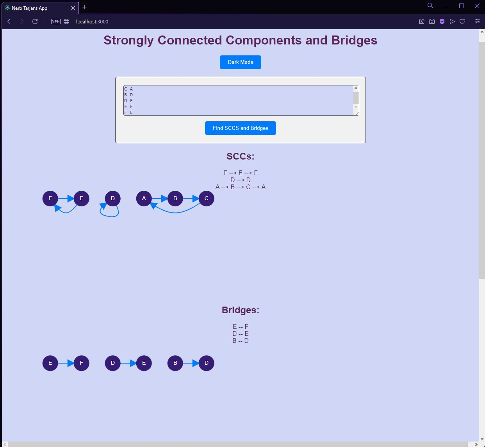

# Tarjans_Algorithm
Tarjans Algorithm

Name    : Nigel Sahl

NIM     : 13521043

## Table of Contents
* [General Info](#general-information)
* [Technologies Used](#technologies-used)
* [Features](#features)
* [Screenshots](#screenshots)
* [How to Run](#how-to-run)
* [Project Status](#project-status)
* [Room for Improvement](#room-for-improvement)


## General Information
Tarjan's algorithm is an algorithm in graph theory for finding the strongly connected components of a graph. It runs in linear time, matching the time bound for alternative methods including Kosaraju's algorithm and the path-based strong component algorithm. The algorithm is named for its inventor, Robert Tarjan. It is based on depth-first search, and bears similarities to the algorithm for topological sorting based on depth-first search.

In this project, I implement Tarjan's algorithm to find strongly connected components and bridges of a graph. The algorithm is implemented in Go language and the user interface is implemented in React. There are two projects in this repository, the first one is the implementation of the algorithm and the backend in Go language, and the second one is the frontend in React. 


## Technologies Used
- Go language
- React
- Javascript


## Features
List the ready features here:
- Input edges of an undirected graph
- Dark mode and light mode
- Finding stongly connected components of a graph
- Finding bridges of a graph

## Screenshots



## How to Run
1. Open the terminal and go to the backend folder in the repository [nerb-tarjans-be](./nerb-tarjans-be/) where the main.go file is located. 
2. Install the required packages using the command 
    ```bash
    go get <package_name>
    ```
3. Run the main.go file using the command 
    ```bash
    go run main.go
    ```
4. Open another terminal and go to the frontend folder in the repository [nerb-tarjans-fe](./nerb-tarjans-fe/) where the package.json file is located.
5. Install the required packages using the command 
    ```bash
    npm install
    ```
6. Run the frontend using the command 
    ```bash
    yarn start
    ```
7. Open the browser and go to the url http://localhost:3000/ to use the application.
8. If you want dark mode, click the dark mode button on the top right corner of the page. If you want back to light mode, click the light mode button on the top right corner of the page.
9. Input the edges of the graph in the input box. The format of the input is as follows:
    ```bash
    <vertex1> <vertex2>
    <vertex3> <vertex4>
    <vertex5> <vertex6>
    # example
    A B
    B C
    C A
    # other example
    A B  B C  C A
    ```
10. Click the button "Find SCCS and Bridges" to find the strongly connected components and bridges of the graph.
11. The strongly connected components and bridges of the graph will be displayed on the page.

## Project Status
Project is: _complete_ 


## Room for Improvement

Room for improvement:
- speed up the algorithm
- improve user interface and user experience

